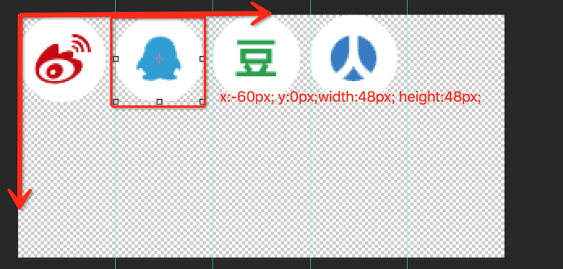

### 网页中实现icon小图标的几种方法
#### 一、开篇: 网页的美观程度往往比这个网页的使用程度更重要，因为它能直接吸引用户的眼球。在网页中，小图标在美工方面的作用更是不言而喻，小图标种类多样，给人以直观的反映。在现有的网站中，99.9%的网站都采用了小图标，说明了小图标的重要性。这里做了一个简单的总结。
#### 二、起因：
>1.  日常工作中时不时需要给页面添加一个icon图标，尽管项目ui库有自带的图标库，然而ui库是怎么把icon图标展示出来的？如果ui库里面没有想要的icon图标，那我如何去创作或者copy新图标？<br>
>2.  新建一个项目又不想下载整个ui库，只想得到对应的图标部分，如何有效率的把想要的图标整合放到项目里面？
>3.  自己私下写的页面想走简约风格，用到字体图标
             
#### 三、实现方式
>1.精灵图实现，精灵图，又叫雪碧图，它是一项技术，合并在一起之后的图片称作雪碧图；在css文档backgroud属性或者伪元素中的content属性里面添加<br>

```css
    div{ 
        width:540px; 
        height:47px; 
        background:url("image/navigation/bg2_center.jpg") repeat-x left top; 
        float:left; 
    } 

    div::before{
        content:url(./xx/xx.jpg);
    }
    
```
>1）为什么不单独调用小图片？因为文件过多时会导致 请求过多、引发性能问题；<br>

<br>


>2）而请求的性能消耗在哪？ 每个小图标的显示都产生一个HTTP请求；一般情况下每次创建一 HTTP请求，请求到的内容 往往是次要的（除非文件特别大）， 性能开销主要在请求、以及响应阶段；造成的性能消耗肯定不小<br>
>3）如何创建雪碧图：CSS Gaga（windows）、photoShop、gulp、webpack(参考文档：https://juejin.im/post/5a5b8ba86fb9a01c9950c643)

```js
    //gulp/tasks/development/sprites.js 
    var gulp = require('gulp');
    var spritesmith = require('gulp.spritesmith'); 
    var config = require('../../config').sprites; 
    /** * Generate sprite and css file from PNGs */
     gulp.task('sprites', function() { 
         var spriteData = gulp.src(config.src)
         .pipe(spritesmith(config.options)); 
         spriteData.img .pipe(gulp.dest(config.dest.image)); spriteData.css .pipe(gulp.dest(config.dest.css)); 
         });

```
>2.字体图标渲染。字体图标是一种自定义字体，依赖于字体文件。只需要将设计的字体文件上传到服务器上，那么网页就可以下载这些文件，让页面展示出来相应的文字。通常认为网页字体只是可读文件。<br>

>1)优点：字体图标比精灵图有一个非常明显的好处，因为他是字体，所以它能加各种文字效果，包括颜色、Hover状态、透明度、阴影和翻转等效果（并且不会失真，而且图片在放大后可能出现锯齿现象），后期项目更换图标样式更方便，在页面中调试相比图片更简单。一旦图标字体加载了，图标就会马上渲染出来，不需要下载一个图像。可以减少HTTP请求，还可以配合HTML5离线存储做性能优化。<br>
>2)不足：字体样式文件很大；使用版权上有限制，有好多字体是收费的；创作自已的字体图标很费时间，兼容性好（css条件规则@font-face兼容性参考：https://developer.mozilla.org/zh-CN/docs/Web/CSS/@font-face)

#### 四、字体图标的应用
>1.需要制作图标的网页图标字体，然后用特定的ASCII字符（如A,B,C,!,@,#等）或者自定义的Unicode编码区域来对应不同的图标。不在这个图标区域内，将不能在使用特殊的Unicode字符。（http://www.ruanyifeng.com/blog/2007/10/ascii_unicode_and_utf-8.html）<br>
>2.使用方法：利用CSS的@font-face规则（确保你已将字体文件上传到了服务器上）定义字体图标文件的路径,确保你的字体来源包括了TrueType, EOT和WOFF字体格式，还需要包括SVG字体格式。虽然SVG正在快速的被WOFF格式替代，但为了兼容老的iOS设备，还是需要提供的。<br>

>3.有三种方式引入，分别为font-class引用、unicode引用、symbol引用.以阿里巴巴矢量图标库为例子，(http://www.iconfont.cn/)<br>
>4.现在我想在项目下用iview1.x下的好多icon图标，如果完全引入iview仅仅用来展示icon图标，那性价比太低了，该如何操作？<br>


